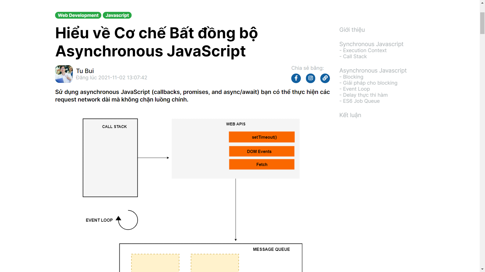
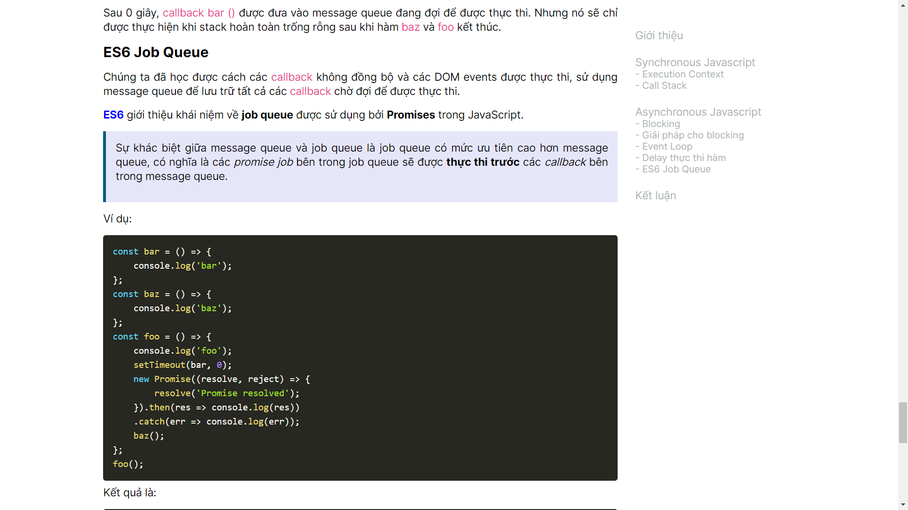

# Tạo data cho GDSCxHUST database

## 🙆‍♂️ Overview

Repo này chứa instructions, mock data, demo cho các bạn tạo data cho database của CLB.

## ✍️ Blogs

Bài viết không chỉ giới hạn về công nghệ, về lifestyle, hust, gdsc... đều welcome nhé!

Xem demo blog trên web tại [đây](https://youtu.be/b6wqJYYOXMg)

### 👉 Kết quả cần nộp

Mỗi bạn ÍT NHẤT 1 bài viết. Nộp vào folder [Blogs](./Blogs). Với mỗi 1 bài viết:

1. 1 file json, xem [Data Format](#-data-format)

2. 1 file html, xem [`rawContent` Format](#-rawcontent-format)

### 👉 Data Format:

Demo json [hieu-ve-co-che-bat-dong-bo-asynchronous-javascript.json](./Blogs/hieu-ve-co-che-bat-dong-bo-asynchronous-javascript.json)

```json
{
  "rawContent": "<div class="post-body"></div>",
  "authorName": "Tu Bui",
  "timeRelease": "2021-11-02T13:40:50Z",
  "timeCreate": "2021-11-02T02:21:50Z",
  "title": "Hiểu về Cơ chế Bất đồng bộ Asynchronous JavaScript",
  "subTitle": "Sử dụng asynchronous JavaScript (callbacks, promises, and async/await) bạn có thể thực hiện các request network dài mà không chặn luồng chính.",
  "coverImgUrl": "https://i.postimg.cc/1X0RxN2h/sv-2.jpg",
  "thumbnailImgUrl": "https://i.postimg.cc/28YRybpq/d6668078-23db-42d3-b311-ea0a97dbd6e6.gif",
  "blogTag": ["Javascript", "Web Development"]
}
```

Trong đó:

- **rawContent**: Nội dung bài blog, xem [rawContent Format](#-rawcontent-format)
- **authorName**: Tên bạn
- **timeRelease**: Thời gian commit data lên repo
- **timeCreate**: Thời gian viết blog
- **title**: Tiêu đề bài viết
- **subTitle**: Phụ đề bài viết, hay tóm tắt nội dung bài viết _tối đa 1 câu hoặc 50 từ_
- **coverImgUrl**: Link ảnh của bạn, xem [Image URL Format](#-image-url-format)
- **thumbnailImgUrl**: Link ảnh thumbnail bài viết, xem [Image URL Format](#-image-url-format)
- **blogTag**: Thể loại của blog, viết hoa chữ cái đầu mỗi từ, một blog có thể có nhiều thể loại, nếu chỉ có 1 thì ghi `["Thể Loại"]`


**Minh họa từ trên xuống: blogTag, title, coverImgUrl, authorName, timeCreate, subTitle, thumbnailImgUrl**

### 👉 `rawContent` Format

Demo html [Hiểu về Cơ chế Bất Đồng bộ Asynchronous Javascript.html](./Blogs/Hiểu%20về%20Cơ%20chế%20Bất%20Đồng%20bộ%20Asynchronous%20Javascript.html)

1. Soạn nội dung html, bắt đầu từ ảnh thumbnail, _không bao gồm `title` và `subtitle`_, tất cả wrap trong:

```html
<div class="post-body">Nội dung blog</div>
```

2. Copy nội dung html rồi paste vào phần `rawContent` trong file JSON.

#### 1️⃣ Heading

Heading bắt đầu từ thẻ `h1` đến `h2`. Trong đó:

- `id`: text trong heading, nhưng viết thường, bỏ dấu, bỏ ký tự đặc biệt, cách nhau bởi `-`

```html
<h2 id="giai-phap-cho-blocking">Giải pháp cho blocking</h2>
```

#### 2️⃣ Ảnh

Dùng `figure`, trong đó:

- `img` ảnh
- `figcaption` caption ảnh

```html
<figure>
  
  <figcaption>Asynchronous JavaScript</figcaption>
</figure>
```

#### 3️⃣ Code

Code có 2 loại:

- **Inline code**: 1 đoạn code ngắn, cùng dòng với văn bản

```html
<code>requestNetwork()</code>
```

- **Code block**: 1 đoạn code dài, hoặc cần highlight.

Trong đó, `language-javascript` là ngôn ngữ của đoạn code, nếu là C 👉 `language-c`, python 👉 `language-python`...

```html
<pre><code class="language-javascript">const second = () =&gt; {
    console.log('Hello there!');
}
const first = () =&gt; {
    console.log('Hi there!');
    second();
    console.log('The End');
}
first();
</code></pre>
```

#### 4️⃣ Quote

Trích dẫn hoặc đoạn văn quan trọng cần highlight, ghi nhớ, như định nghĩa, so sánh...
Dùng `blockquote`

```html
<blockquote>
  <p>
    JavaScript có một call stack duy nhất vì nó là một ngôn ngữ lập trình đơn
    luồng. Call Stack có cấu trúc LIFO nghĩa là các mục chỉ có thể được thêm
    hoặc xóa khỏi đầu stack.
  </p>
</blockquote>
```

#### 5️⃣ Khác

Văn bản `p`, bảng `table`, in đậm `strong`, in nghiêng `em`, **link `a` phải thêm `target="_blank"`**, list `ul` hoặc `ol`

**Minh họa từ trên xuống: Heading, Văn bản, Inline Code, Link, Blockquote, Block Code**



### 👉 Image URL Format

1. Upload ảnh lên [postimg.org](https://postimages.org/)

2. Lấy **Direct link**

## 🚵 Events

_updating..._

:computer: with :heart: by [@theobmgit](https://github.com/theobmgit)
